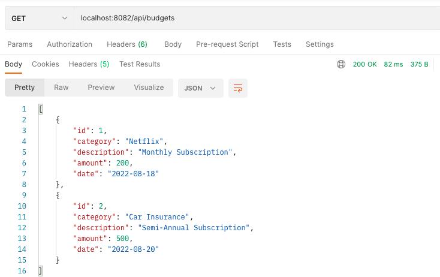

# EventTrackerProject

## Description
This is a built upon project with the first installation being the primary database structure and REST applications with SQL. All queries are dealt with MySQL with CRUD functions. The main purpose of this application is to track finances and later on be given options to show where a user can save money or have excess money to use elsewhere.

* Beginning Database Schema

* Find All Mapping

* Find by Id Mapping

* Add Mapping

* Update Mapping

* Delete Mapping

## Technologies
* AWS- EC2
* Git
* GitHub
* Gradle
* Java  
* MySQL Workbench
* SpringToolSuite4
* Spring Boot
* Spring MVC
* Terminal -zsh
* Postman

## Lessons Learned
This was a very useful assignment as it gave me more experience using Postman and getting familiar with REST.
